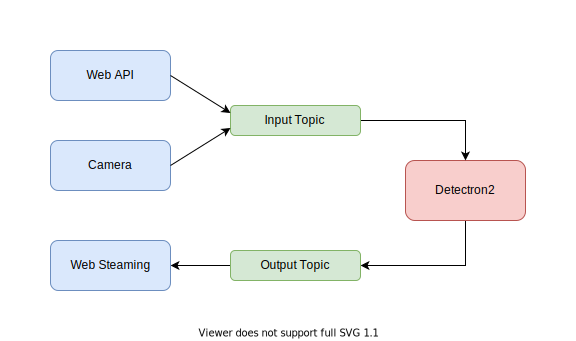

# Real-time object detection system

## YouTube Demo
[](https://youtu.be/Lb9YkpU3d9k "Demo")

## Scheme of project



## Install

### 1. Kafka

#### [Download Page](https://kafka.apache.org/downloads)  
Click on: *source download: kafka-\*-src.tgz*

- Extract .tgz archive to project directory
- Rename directory to "kafka"

#### Run ZooKeeper
```bash
kafka/bin/zookeeper-server-start.sh \
   kafka/config/zookeeper.properties
```

#### Run Kafka
```bash
kafka/bin/kafka-server-start.sh \
    kafka/config/server.properties
```

### 2. Detector

There are 2 options: **Run in Docker container** or **Run locally**

#### Run in Docker container

```bash
docker run marshtupa18/real-time-object-detection-system:latest
```

##### OPTIONAL: Build your own image

Add more RAM for you docker-machine to avoid problem during building

```bash
docker build . -f Dockerfile -t <NEW_IMAGE_NAME>
```

#### Run locally

Setup virtual environment
```bash
pip install virtualenv
virtualenv venv
source venv/bin/activate
```

Install all dependencies
```bash
pip install -r requirements.txt
pip install -r requirements-detectron2.txt
```
Run application
```bash
python Detector.py
```

